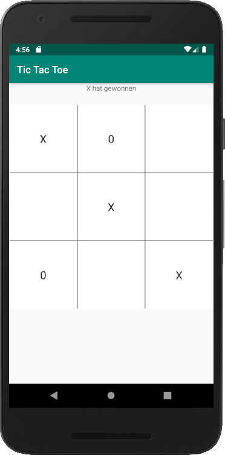
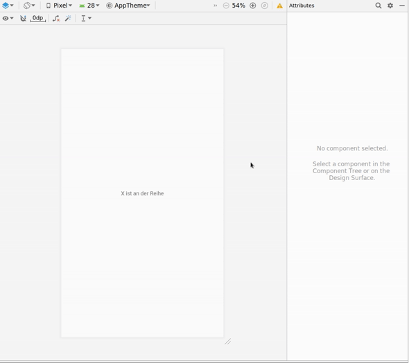
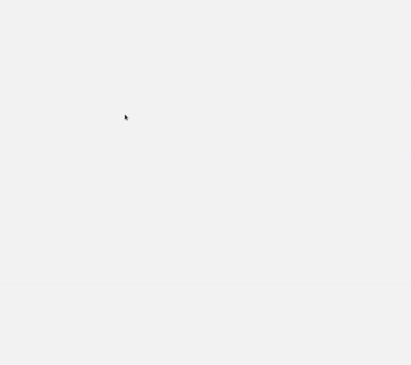
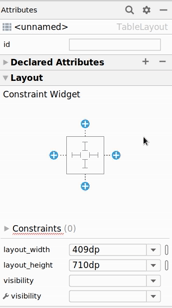
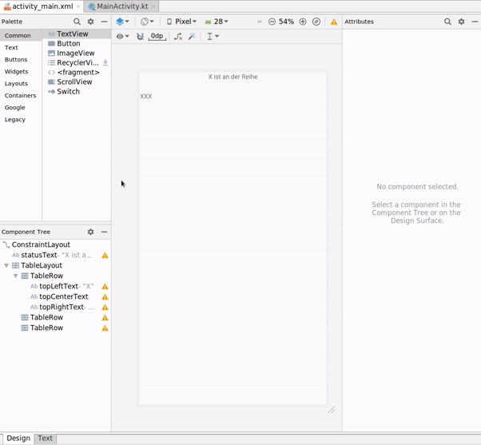
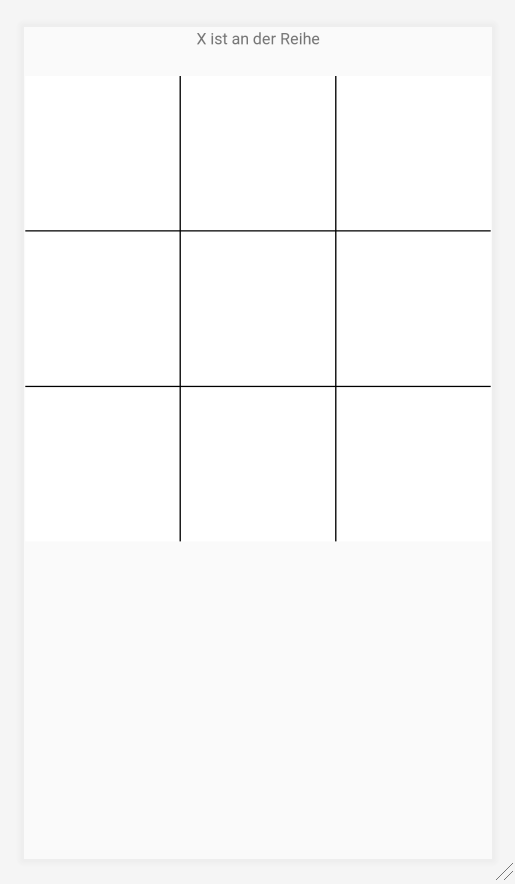
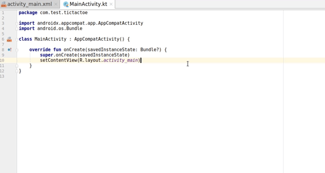
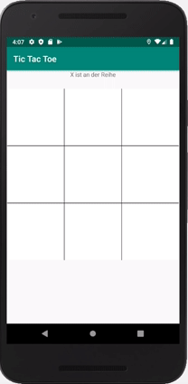
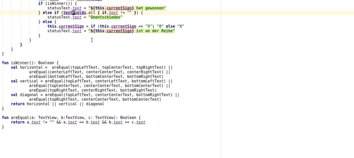

# Tic Tac Toe

Inspiriert von [Android App programmieren: TicTacToe (Anfänger)](https://www.youtube.com/watch?v=1lnxpZZw9hc)

Wir wollen ein Tic Tac Toe Spiel für Android programmieren.



## Das "Tic Tac Toe" Projekt generieren

Im "Start Up" dialog von Android Start, auf "+Start a new Android project" klicken um ein neues Projekt zu generieren.  

Wenn das Dialog schon zu ist, können neue Projekte durch _File > New > New Project_ generiert werden.

Ein Dialog in zwei Schritte konfiguriert das Projekt:
- Die  "Empty Activity" auswählen und auf _Next_ klicken.
- "Tic Tac Toe" als _Name_ setzen.
- Sicherstellen, dass folgende Werte richtig gesetzt sind:
  - Die _Language_ ist "Kotlin"
  - Die _Minmum API Level_ ist "API 24: Android 7.0 (Nougat)"

Nachdem "Finish" geklickt wurde, generiert Android studio ein Neues Projekt. Zwei Dateien aus dem _app_ Ordner sind für uns besonderst wichtig:
- `activity_main.xml` (in _app > res > layout_) ist die Layout-Datei mit dem einem "Hellow World" text.
- `MainActivity.kt` (_app > java > com.example.tictactoe_) hat bereits den _Main_ "Entry point", mit dem nötigen Code, um das Layout zu laden.

## Das Layout gestalten

Zuerst kümmern wir uns um das Layout.

Wir möchten einen Statustext ganz oben und darunter eine Tabelle mit drei Spalten und drei Zeilen, in der die `X` und `0` gesetzt werden.

### Der Statustext

Für den Statustext können wir das "Hello World" Textfeld benutzen.

Auf "Hello World" klicken und in den _Attributes_ Panel folgende Werte setzen:

- _id_: `statusText`
- _text_: `X ist an der Reihe`
- Untere _Constraint_ im Layout entfernen  
  

### Das Spielgitter

Für das Spielgitter benutzen wir eine Tabelle.

Zuerst können wir ein _Table Layout_ aus der linke Palette ziehen und unter den "X ist an der Reihe" Text plazieren.



Die Tabelle soll ein wenig Rand bekommen und quadratisch dargestellt werden.  

Per Mausklick die Tabelle aktivieren und in _Constraint Widget_-Panel diese Werte setzen:

- _Left Margin_ und _Right Margin_ sollen auf `8` gesetzt werden
- _Top Margin_ auf `24`.
- Eine "Top Constraint Layout" setzen.
- Das Breite/Höhe Verhältnis auf `1:1` setzen



Für das Tic Tac Toe Spiel soll die Tabelle aus drei Zeilen und drei Spalten bestehen.  

Im _Component Tree_ Panel, das _TableLayout_ Element auswählen und:

- Die letzte Row entfernen.
- Die drei Rows markieren und in den _Attributes_ Panel, den _layout_weight_ auf `1` setzen.
- In der erste Zeile (Row), ein _TextView_-Feld aus der _Palette_ / _Text_ hinzufügen und sein _text_ auf `X` setzen
- Im _Component Tree_, das soeben kreierte Feld kopieren und zwei mal in der erste Zeile einfügen (`ctrl-c ctrl-v ctrl-v`...)
- Die _id_ auf `topLeftText`, `topCenterText` und `topRightText` setzen
- Im _Component Tree_ alle drei Text-Felder auswählen und in den _Attributes_:
  - _layout_height_ auf _match_parent_ setzen.
  - _textAppareance_ auf _Large_ setzen
  - Bei _gravity_, _center_ aktivieren
  - _layout_weight_ auf `1` setzen.
- 
    - Im _Component Tree_
      - alle drei Text-Felder auswählen,
      - sie kopieren (`ctrl-c`)
      - und in den zwei weitere Zeilen einfügen (`ctrl-v`)
      - die _id_s umbenennen (`centerLeftText` bis `bottomRightText`)

Wir müssen noch die Linien zeichnen lassen indem wir ein Rahmen definieren.  
Leider haben die Tabellen keine Rahmen und wir müssen mit den Hintegrund von der Tabelle und den Zellen _spielen_...  
Im _Component Tree_ TableView auswählen und in den _Attributes_ der Wert von _background_  auf `@android:color/black` setzen: Du kannst anfangen "black" ins Inputfeld zu schreiben, und Android Studio wird die _richtige_ Farbe vorschlagen (falls _background_ nicht sichtbar ist, kannst du ihn suchen...).

Dann müssen wir im _Component Tree_ alle neun Zellen auswählen (vor dem Klicken, die "Ctrl"-Taste drücken) und ihren _background_ auf `@android:color/white` setzen.

Wir brauchen noch die Ränder anzupassen:

- Für die drei Zellen in der mittleren Spalte, setzen wir den _Layout_marginLeft_ und _Layout_marginRight_ auf `1dp`
- Für die drei Zellen in der mittleren Zeile, setzen wir den _Layout_marginTop_ und _Layout_marginBottom_ auf `1dp`

Das Layout ist fertig: wir können noch den `X` im _text_ bei allen Zellen entfernen.



Es ist nun Zeit zur `MainActivity.kt` zu wechseln und mit dem Programmieren anfangen.

## Im Emulator die App ausführen

Während der Gestaltungphase konnten wir das Design in Android Studio sehen. Sobal wir Code in der App haben, brauchen wir den Emulator, damit wir unser Programm wirkt.

Falls kein Emulator bereits Konfiguriert ist, kannst du darüber [lesen](emulator.md).

Der grüne Dreieck in der Toolbar startet das Emulator mit dem aktiven Projekt.

## Die Logik programmieren

In `MainActivity.kt` wurde eine `MainActivity` Klasse mit der `onCreate()` Funktion für uns generiert. `onCreate()` hat auch bereits eine  Verbindung mit der Layout-Datei:

```kt
setContentView(R.layout.activity_main)
``` 

Unsere erste Programmierungaufgabe ist ein `X` im oberen linken Feld erscheinen lassen, wenn wir darauf klicken. Dafür ergänzen wir die `onCreate()` Funktion mit unseren Code.

Wenn im Layout für das erste Textfeld die _ID_ `topLeftText` gesetzt hast, kanns du nach Zeile 11 eine neue Zeile hinzufügen und dort anfangen `top` zu schrieben. Android Studio sollte `topLeftText` vorschlagen: du kannst die Option mit der Eingabe-Taste bestätigen:



Damit hilft dir Android Studio nicht nur lange Namen zu tippen, sondern fügt er auch auf Zeile 5 ein `import`, dass alle Felder aus dem Layout im Code zu verfügung stellt:

```kt
import kotlinx.android.synthetic.main.activity_main.*
```

Wenn du `topLeftText` ohne hilfe von Android Studio getippt hast, musst du noch die `import` zeile auch selber hinzufügen.

Jedes Feld aus dem Layout hat eine leere `setOnClickListener` Funktion die wir erweitern werden.

Hier hilft dir Android Studio wieder beim Tippen: statt `setOnClickListener` kannst du `socl` tippen (die erste Buchstaben von "set on click listener"), die Version mit geschleifte Klammern wählen (`{}`) und Android Studio kümmert sich um den Rest:


Der Code ist ganz einfach: wenn das Feld geglickt wird, setzten wir den `text` von `topLeftText` auf `X`:

```kt
override fun onCreate(savedInstanceState: Bundle?) {
    super.onCreate(savedInstanceState)
    setContentView(R.layout.activity_main)

    topLeftText.setOnClickListener {
        topLeftText.text = "X"
    }
}
```



Wir wollen den gleichen Click Listener für alle text Felder definieren. Dafür definieren wir eine Liste von Felder und brauchen eine `For`-Schleife und den Empfänger (_Listener_) zu definieren:

Wir ersetzen

```kt
topLeftText.setOnClickListener {
    topLeftText.text = "X"
}
```

mit

```kt
val textFields = arrayOf(topLeftText, topCenterText, topRightText,
    centerLeftText, centerCenterText, centerRightText,
    bottomLeftText, bottomCenterText, bottomRightText)

for (textField in textFields) {
    textField.setOnClickListener {
        (it as TextView).text = "X"
    }
}
```

Wir haben drei Änderungen gemacht:

- zuerst haben wir die neun felder aus dem Layout in der Array `textFields`,
- mit eine `for`-Schleife gehen wir duch alle `textField` in `TextFields` durch,
- wir setzen nicht mehr direkt den `X` im text vom `topLeftText`, sondern in dem `it` Parameter, den `setOnClickListener` uns zu verfügung stellt (du kannst ein Hinweis darauf neben der `{` sehen: `it:View!`)

Und schon können wir alle neun `X` setzen.

Aber es soll abwechslungsweise eine `X` und eine `0` setzen! Wir definieren also ein _Class field_ mit den Zeichen `X` oder `0`:

```kt
class MainActivity : AppCompatActivity() {

    private var currentSign = "X"

    override fun onCreate(savedInstanceState: Bundle?) {

        // ...

        for (textField in textFields) {
            textField.setOnClickListener {
                (it as TextView).text = currentSign
                currentSign = if (currentSign == "X") "0" else "X"
            }
        }
    }
}
```

Die wichtige Änderungen sind:

- wir definieren `currentSign`, initialisiert auf `X`
- beim Clicken setzen wir den Text auf dem Wert von `currentSign`...
- ... und wir setzen `currentSign` abwechslungsweise auf `X` und `0`

Aber es gibt ein Problem: wir können auf dem gleichen Feld zwei Mal klicken und den Zeichen ändern. Das sollte nicht sein:

```kt
textField.setOnClickListener { view ->
    view as TextView
    if (view.text == "") {
        view.text = currentSign
        currentSign = if (currentSign == "X") "0" else "X"
    }
}
```

- wir _umbenennen_ den `it` parameter in `view` und casten zu eine `TextView`,
- bevor wir den Text-Feld setzen, prüfen wir, ob der Text noch leer ist.

Es gibt noch ein Schönheitsfehler: der Statustext wird nicht aktualisiert: Wir fügen diese Zeile am Ende der `if`-Bedingung:

```kt
statusText.text = "${currentSign} ist an der Reihe"
```

Fehlt noch was? Das Spiel soll prüfen, ob jemand gewonnen hat!

## Hat jemand gewonnen?

Um zu wissen, ob jemand gewonnen hat, muss das Programm prüfen, ob die es drei Nachbarfelder gleich sind.

Dafür fügen wir zur Klasse `MainActivity` die private Funktion `isWinner()`:

```kt
    fun isWinner(): Boolean {
        return topLeftText.text == topCenterText && topCenterText == topRightText
    }
```

In einem ersten Schritt prüfen wir, ob die drei Felder in der erste Zeile gleich sind.

Ist das genug? Nein, wir müssen auch sicherstellen, dass sie entweder `X` oder `0`. Wenn all drei Felder leer sind, hat noch niemand gewonnen:

```kt
    fun isWinner(): Boolean {
        return topLeftText.text != "" && topLeftText.text == topCenterText && topCenterText == topRightText
    }
```

Es geht weiter mit der zweite Zeile:

```kt
    fun isWinner(): Boolean {
        return (topLeftText.text != "" && topLeftText.text == topCenterText && topCenterText == topRightText) ||
            (centerLeftText.text != "" && centerLeftText.text == centerCenterText && centerCenterText == centerRightText)
    }
```

... und die dritte:

```kt
    fun isWinner(): Boolean {
        return (topLeftText.text != "" && topLeftText.text == topCenterText && topCenterText == topRightText) ||
            (centerLeftText.text != "" && centerLeftText.text == centerCenterText && centerCenterText == centerRightText) ||
            (bottomLeftText.text != "" && bottomLeftText.text == bottomCenterText && bottomCenterText == bottomRightText)
    }
```

Es ist noch lange noch nicht fertig, wir wiederholen wir hier aber stark. Wir können eine zweite Funktion hinzufügen: `areEqual()`.


```kt
fun isWinner(): Boolean {
    return areEqual(topLeftText, topCenterText, topRightText) ||
            areEqual(centerLeftText, centerCenterText, centerRightText) ||
            areEqual(bottomLeftText, bottomCenterText, bottomRightText)
}

fun areEqual(a: TextView, b:TextView, c: TextView): Boolean {
    return a.text != "" && a.text == b.text && b.text == c.text
}
```

Wir müssen nur noch die Spalten und die zwei Diagonalen prüfen...

```kt
fun isWinner(): Boolean {
    val horizontal =  areEqual(topLeftText, topCenterText, topRightText) ||
            areEqual(centerLeftText, centerCenterText, centerRightText) ||
            areEqual(bottomLeftText, bottomCenterText, bottomRightText)
    val vertical = areEqual(topLeftText, centerLeftText, bottomLeftText) ||
            areEqual(topCenterText, centerCenterText, bottomCenterText) ||
            areEqual(topRightText, centerRightText, bottomRightText)
    val diagonal = areEqual(topLeftText, centerCenterText, bottomRightText) ||
            areEqual(topRightText, centerCenterText, bottomLeftText)
    return horizontal || vertical || diagonal
}
```

... und dann die Prüfung im Code einfügen:


```kt
if (view.text == "") {
    view.text = currentSign
    if (isWinner()) {
        statusText.text = "${currentSign} hat gewonnen"
    } else {
        currentSign = if (currentSign == "X") "0" else "X"
        statusText.text = "${currentSign} ist an der Reihe"
    }
}
```

## Ist das Spiel unentschieden?

Das ist einfach: das Spiel ist unentschieden wenn alle Felder wurden ausgefüllt.

Um das herauszufinden, wäre praktisch, auf der Liste alle Textfelder zugreifen zu können: wir können `textFields` in ein "Class field" umwandeln.

Android Studio kann ein Teil der Arbeit für dich erledigen: du kannst den `val` vor `textFields` löschen und dann auf der rote Glübirne klicken und "Create property 'textFields' property" auslösen.  
Es gibt noch ein kleines Problem: bevor `onCreate()` die Verbindung mit dem Layout herstellt, kann `textFields` nicht gefüllt werden. Wir müssen das ausdrücklich mit `lateinit` angeben (und implizit versprechen, dass wir `textFields` nicht brauchen, bevor es vollständig ist):

```kt
class MainActivity : AppCompatActivity() {

    private lateinit var textFields: Array<TextView>

    // ...
    
    override fun onCreate(savedInstanceState: Bundle?) {
        super.onCreate(savedInstanceState)
        setContentView(R.layout.activity_main)

        textFields = arrayOf(topLeftText, topCenterText, topRightText,
            centerLeftText, centerCenterText, centerRightText,
            bottomLeftText, bottomCenterText, bottomRightText)

    // ...
    }

    // ...
}
```


Und jetzt können wir prüfen, ob alle Felder bereits ausgefüllt sind :

```kt
if (isWinner()) {
    statusText.text = "${currentSign} hat gewonnen"
} else if (textFields.all { it.text != "" }) {
    statusText.text = "Unentschieden"
} else {
    currentSign = if (currentSign == "X") "0" else "X"
    statusText.text = "${currentSign} ist an der Reihe"
}
```

Die `else if`-Bedingung sieht sehr einfach aus: aber werden wir sie ohne weitere Kommentare auch verstehen, wenn wir in der Zukunft wieder mit diesem Code beschäftigen?

Es ist doch besser eine kurze `isTie()` Funktion zu schreiben:

```kt
private fun isTie() {
	return textFields.all { it.text != "" }
}
```

Wir können auch den _Refactor_-Werkzeug von Android Studio gebrauchen:



Damit lernen wir, dass Kotlin eine Spezielle schreibart bietet, für Funktionen die aus eine einzelne Zeile bestehen:

```kt
private fun isTie() = textFields.all { it.text != "" }
```

Die Logik des Codes sieht nun so aus:

```kt
if (isWinner()) {
    statusText.text = "${currentSign} hat gewonnen"
} else if (isTie()) {
    statusText.text = "Unentschieden"
} else {
    currentSign = if (currentSign == "X") "0" else "X"
    statusText.text = "${currentSign} ist an der Reihe"
}
```

## Jedes Spiel hat ein Ende

Nachdem jemand gewonnen hat, fügt jedes weitere Klick ein Zeichen hinzu bis alle Felder ausgefüllt sind.

Wir wollen das ändern und dann das Spiel neustarten.

Dafür brauchen wir:

- Eine `gameOver` Variable die wir auf `true` setzen wenn, das Spiel zu Ende geht.
- Eine `if`-Bedingung die prüft, das Spiel zu Ende ist.
- Eine `resetGame` Funktion, die das Brett wieder leert.

Zuerst definieren wir die `gameOver` Klassenfeld:

```kt
class MainActivity : AppCompatActivity() {

    private lateinit var textFields: Array<TextView>
    private var currentSign = "X"
    private var gameOver = false

    override fun onCreate(savedInstanceState: Bundle?) {
        // ...
    }
    // ...
}
```

... und dann die `resetGame` Funktion...


```kt
class MainActivity : AppCompatActivity() {

    // ..

    override fun onCreate(savedInstanceState: Bundle?) {
        // ...
    }

    // ...

    private fun resetGame() {
        gameOver = false
        currentSign = "X"
        statusText.text = "${currentSign} ist an der Reihe"
        for (field in textFields) {
            field.text = ""
        }
    }
}
```

... und schliesslich `gameOver` als `true` setzen wenn jemand gewonnen hat oder das Spiel unentschieden ist und dann, beim nächsten Klick, das Spiel neustarten:

```kt
for (textField in textFields) {
    textField.setOnClickListener { view ->
        view as TextView
        if (gameOver) {
            resetGame()
        } else {
            if (view.text == "") {
                view.text = currentSign
                if (isWinner()) {
                    statusText.text = "${currentSign} hat gewonnen"
                    gameOver = true
                } else if (isTie()) {
                    statusText.text = "Unentschieden"
                    gameOver = true
                } else {
                    currentSign = if (currentSign == "X") "0" else "X"
                    statusText.text = "${currentSign} ist an der Reihe"
                }
            }
        }
    }
}
```

## Todo

- Resize the table to fit the screen.
- Check that the screencast and screenshot match the final code.
- Create a repository with commits for each step.
